# Comprehensive Evaluation Results

_Auto-generated after running evaluation scripts. Images are embedded below._

## Dataset 4k

- Metrics CSV: `results_runs/4k/metrics_20250824_155821.csv`

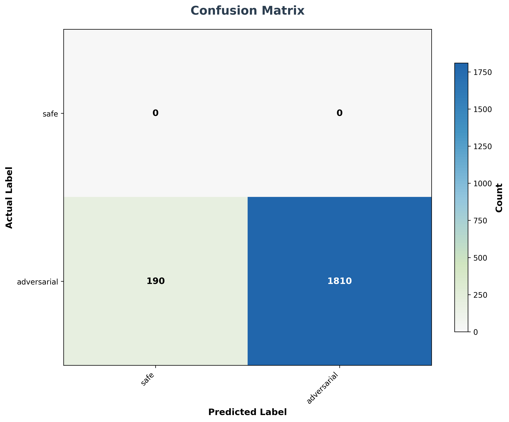

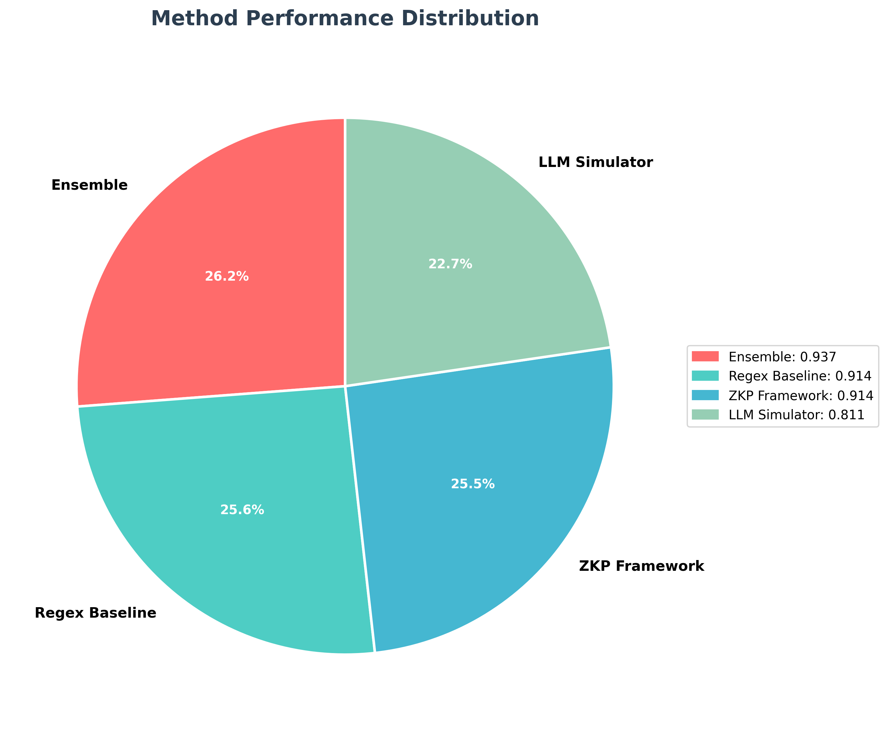

## Dataset 6k

- Metrics CSV: `results_runs/6k/metrics_20250824_155831.csv`

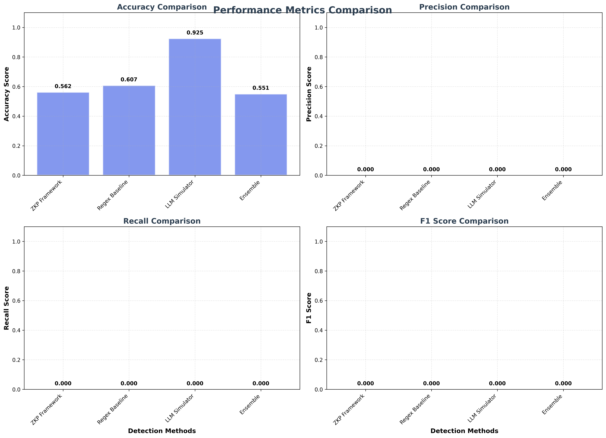

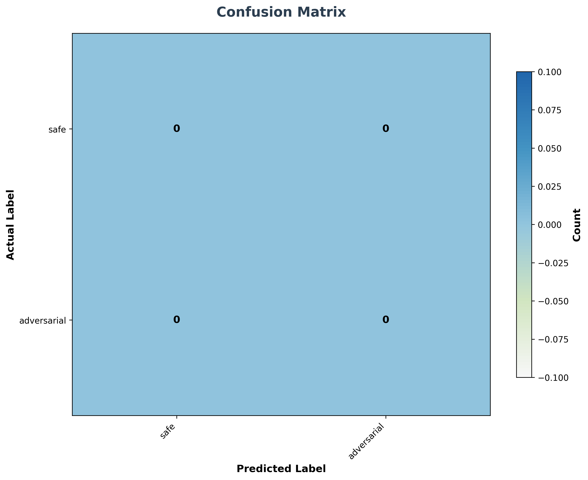

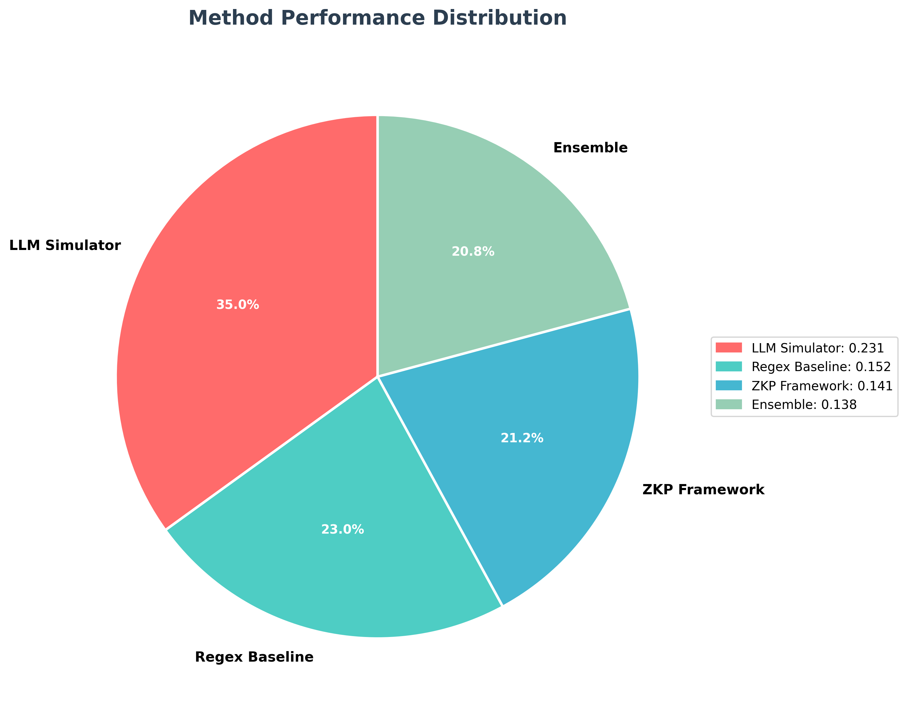

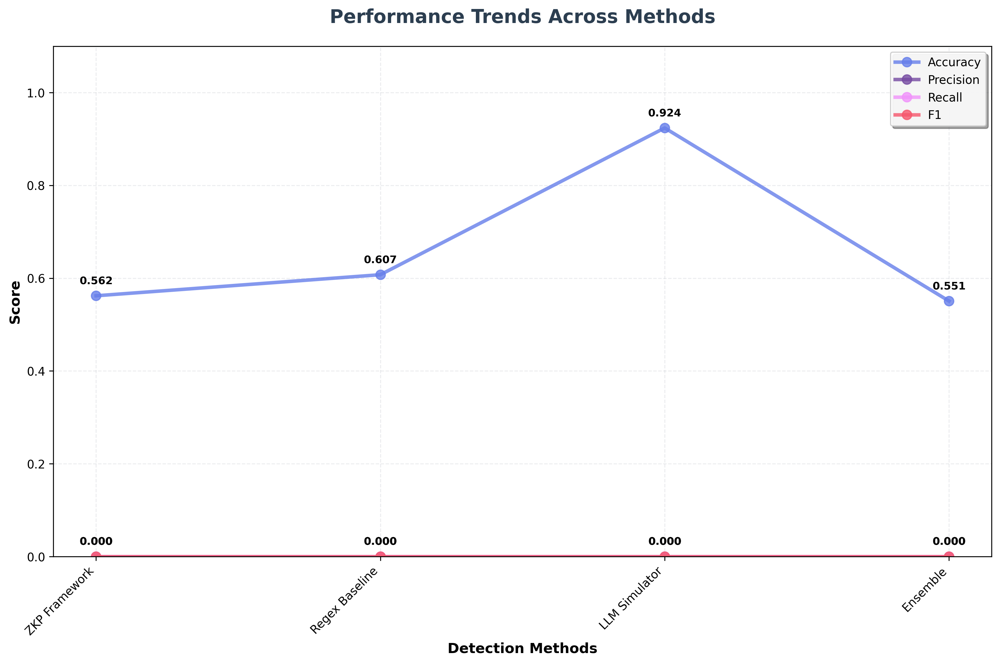

## Dataset 50k

- Metrics CSV: `results_runs/50k/metrics_20250824_155902.csv`

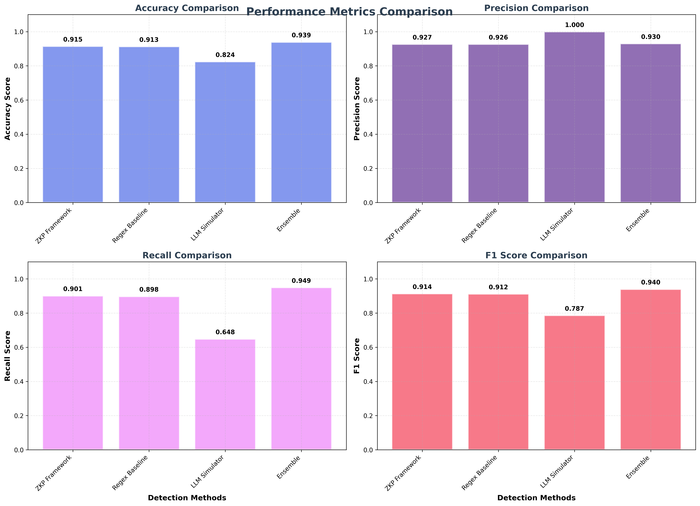

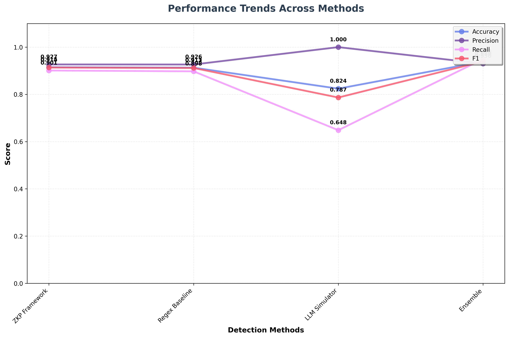

## Dataset 120k

- Metrics CSV: `results_runs/120k/metrics_20250824_160005.csv`

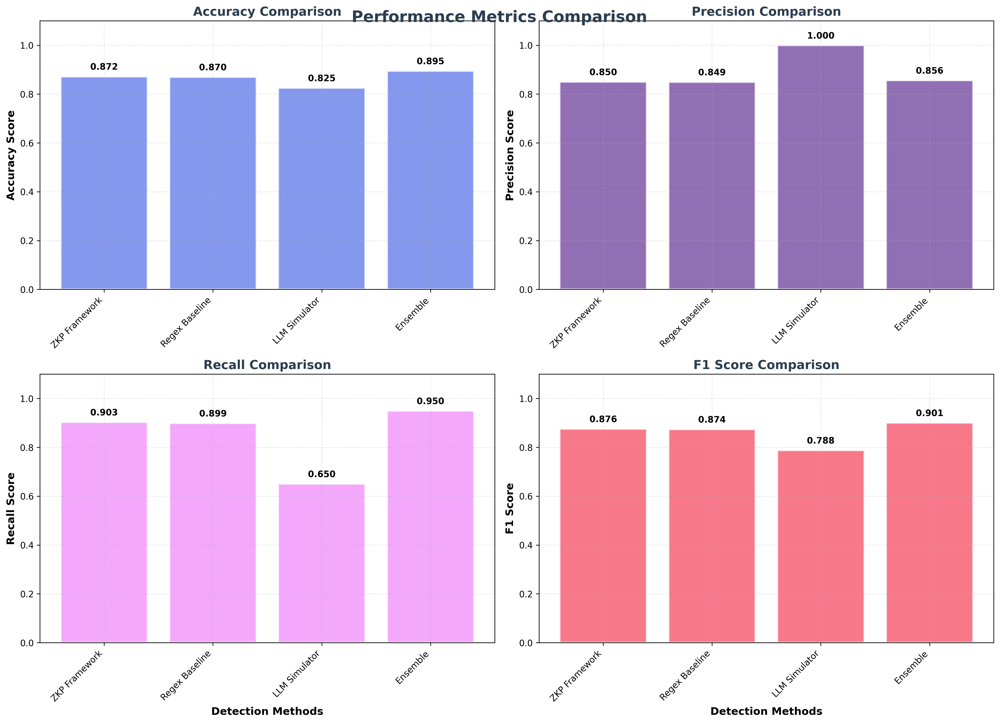

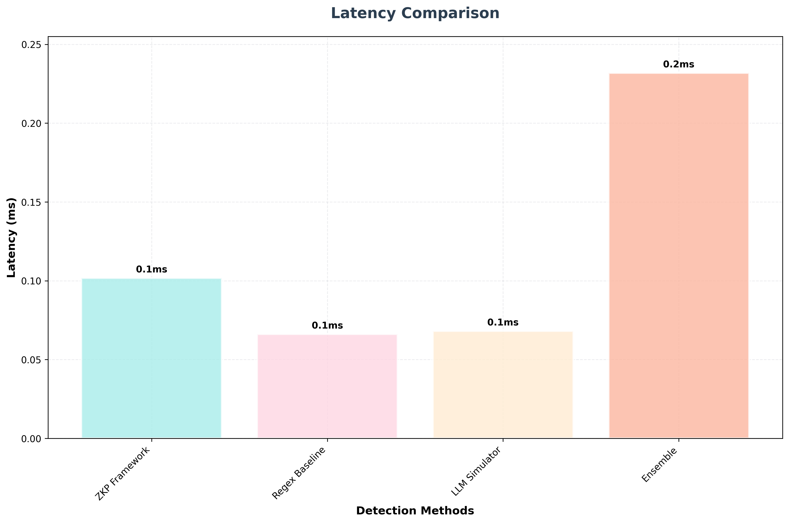

## Dataset 200k

- Metrics CSV: `results_runs/200k/metrics_20250824_160145.csv`

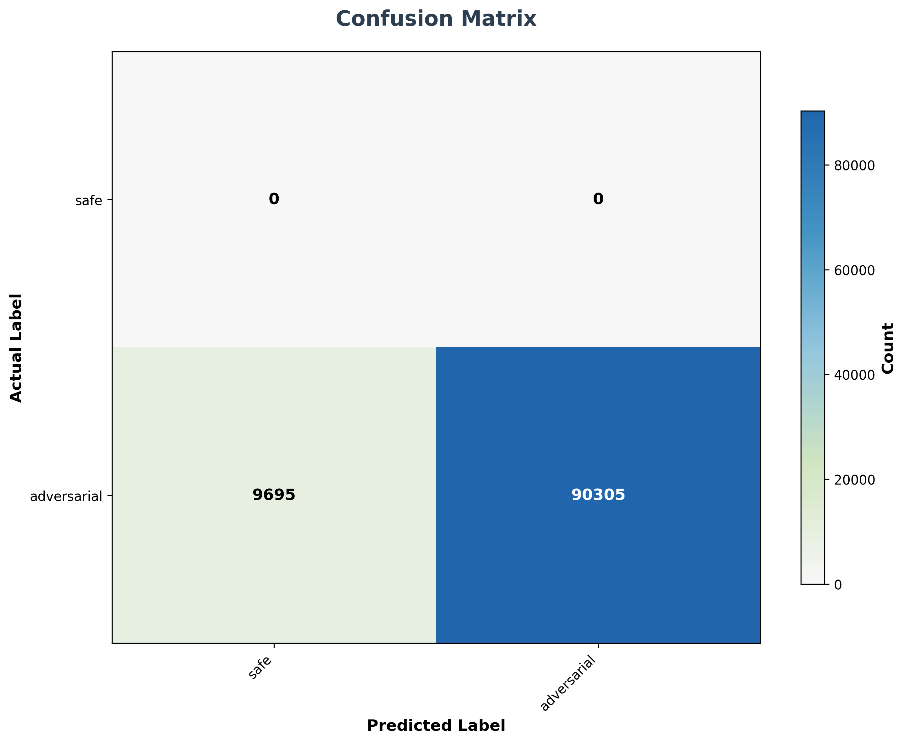

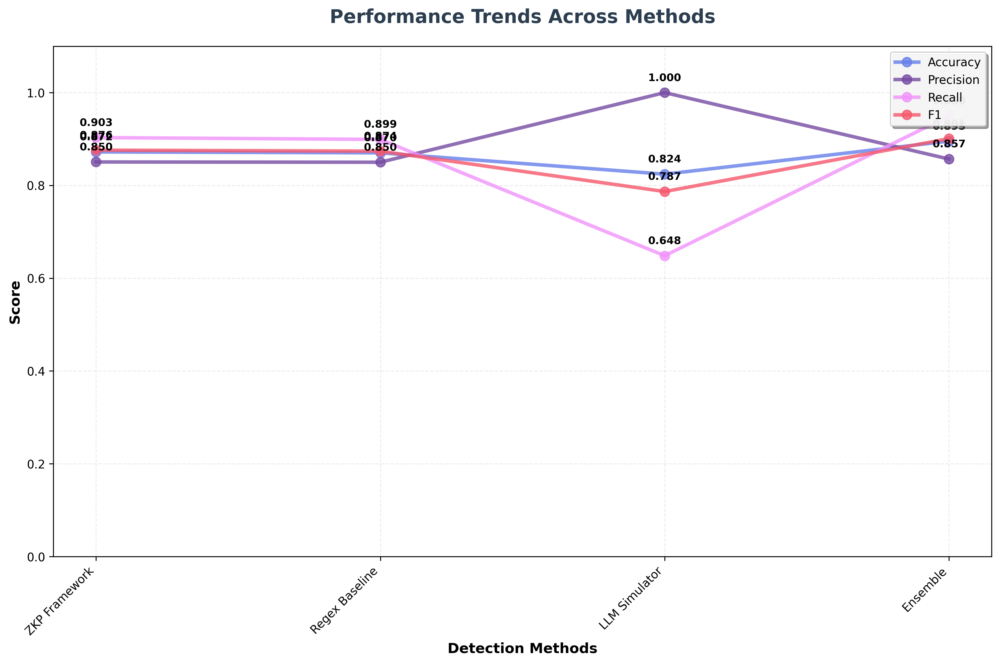

## Anti-Collusion

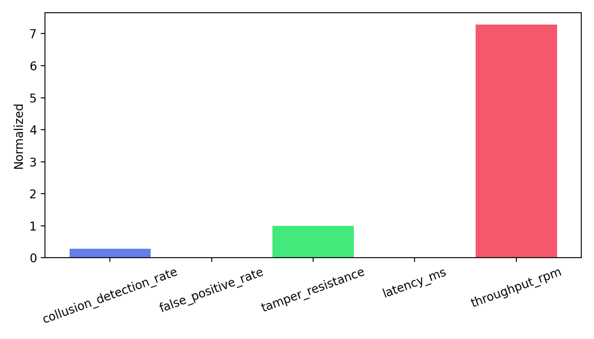

- Metrics CSV: `results_anticollusion/anticollusion_metrics_20250824_132552.csv`
