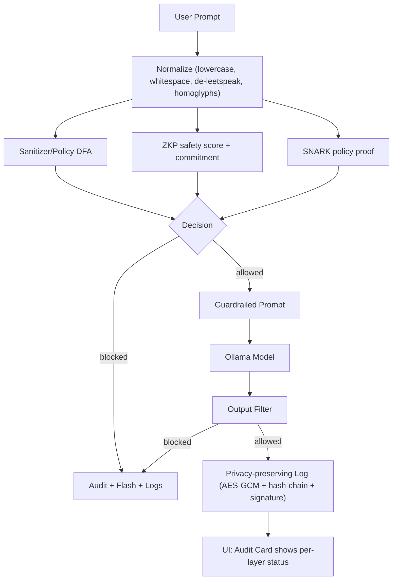
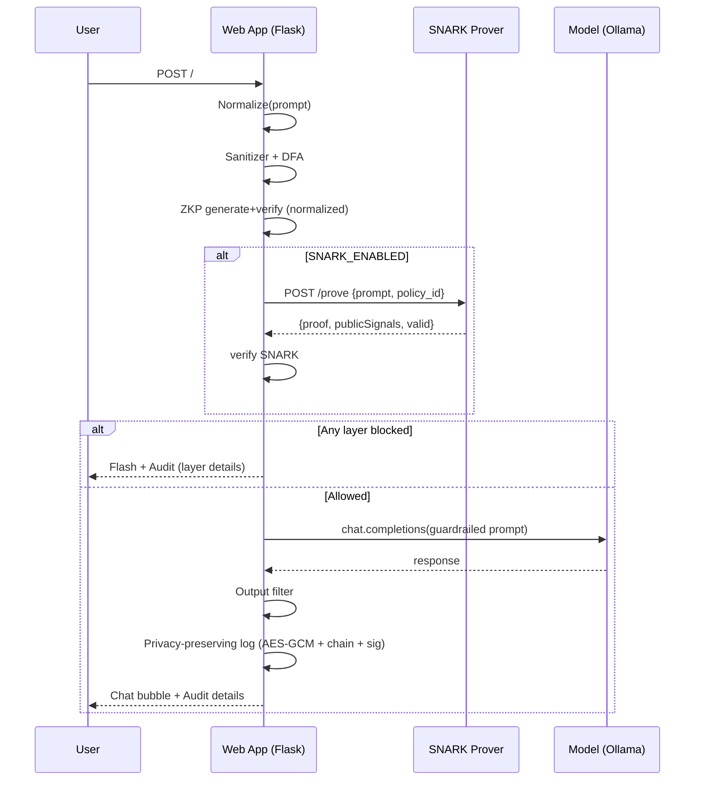
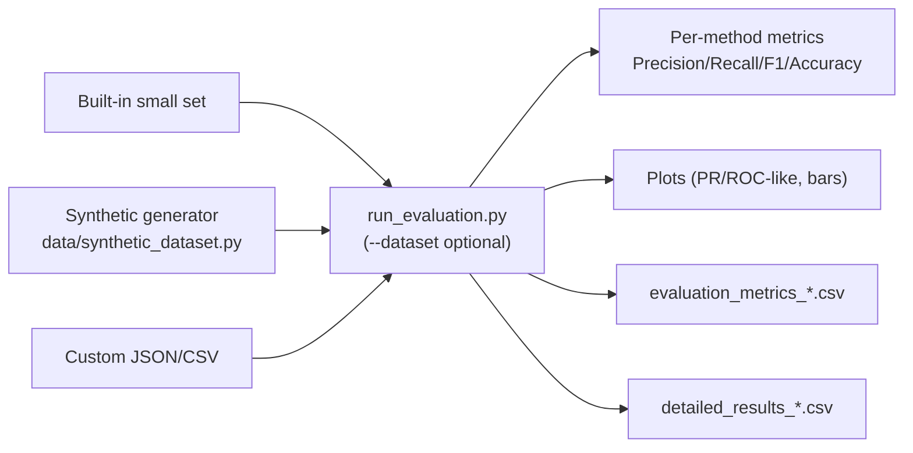
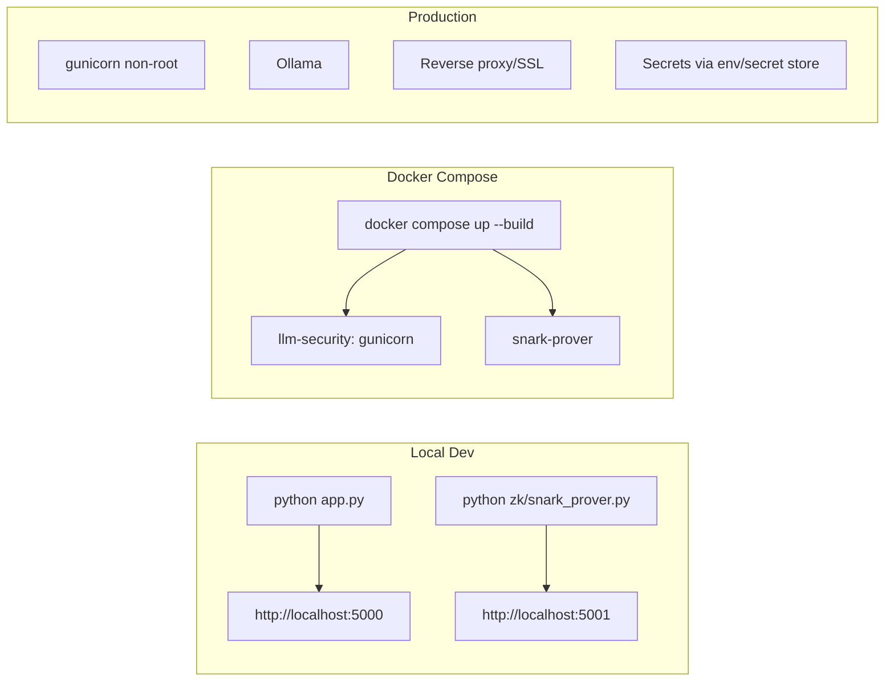

# prompt-injection-mitigation-by-multilayer-cryptographic-security

This project experiments with multi-layer defenses for LLM prompt injection, combining simulated ZK proofs with logging, filtering, and evaluation tooling.

## Quick start
- Install: `pip install -r requirements.txt`
- Generate signing keys: `python generate_keys.py`
- Run app: `python app.py`

## Synthetic dataset
- Generate large datasets to improve accuracy/precision/recall:
  - JSON: `python data/generate_synthetic_dataset.py -b 25000 -a 25000 -f json -o data/synth_50k.json`
  - CSV: `python data/generate_synthetic_dataset.py -b 100000 -a 100000 -f csv -o data/synth_200k.csv`

## Evaluation
- Built-in small set: `python run_evaluation.py`
- External dataset: `python run_evaluation.py -d data/synth_50k.json`
- Outputs include metrics CSV, detailed results CSV, and plots (tagged by dataset name).

Note: Current ZKP implementation is a simulation suitable for research/development and interface testing; not a production cryptographic proof.

## SNARK (simulated) integration
- Start both services with Docker Compose:
```bash
docker compose up --build
```
- The app will call the prover at `http://snark-prover:5001` (see `docker-compose.yml`).
- Local run without Docker:
```bash
# in one terminal
export SNARK_ENABLED=true
export SNARK_PROVER_URL=http://127.0.0.1:5001/prove
export SNARK_VERIFY_URL=http://127.0.0.1:5001/verify
python zk/snark_prover.py

# in another terminal
export SNARK_ENABLED=true
export SNARK_PROVER_URL=http://127.0.0.1:5001/prove
export SNARK_VERIFY_URL=http://127.0.0.1:5001/verify
python app.py
```
- Note: current prover is simulated; replace with real Circom/PLONK prover later.

## Policy and normalization
- Shared normalizer: lowercase, whitespace collapse, de-leetspeak, homoglyph folding; versioned via `NORMALIZER_VERSION`.
- DFA-based policy (trie) loaded via `POLICY_TERMS_PATH` (JSON list). Used inside ZKP safety scoring and can be mirrored in SNARK.

## Security
- CSRF protection enabled on all POST routes; secure cookies (Secure/HttpOnly/SameSite=Lax).
- Persistent AES key for `SecureLogger` via `SECURE_LOGGER_AES_KEY` or `keys/aes.key`.

## Container
- App runs under gunicorn as non-root; healthcheck added.

## Architecture (multilayer: SNARK + ZKP + heuristics)


## Request lifecycle (sequence)


## Evaluation workflow (datasets → metrics)


## Deployment workflows


## Environment variables
- Core
  - OLLAMA_BASE_URL (default http://localhost:11434/v1)
  - OLLAMA_MODEL (default gemma:2b)
  - FLASK_SECRET_KEY
- SNARK
  - SNARK_ENABLED=true|false
  - SNARK_PROVER_URL, SNARK_VERIFY_URL
  - SNARK_POLICY_ID
  - SNARKJS_PATH (optional, for real proving)
  - CIRCUIT_DIR (defaults to zk/build)
- Policy
  - POLICY_TERMS_PATH (JSON list for DFA)
  - NORMALIZER_VERSION (embedded constant in code)
- Logging
  - SECURE_LOGGER_AES_KEY (hex, optional; else keys/aes.key)
- Admin
  - ADMIN_USERNAME, ADMIN_PASSWORD

## Run (local)
```bash
# Terminal 1: SNARK prover (simulated or snarkjs if configured)
export SNARK_ENABLED=true
export SNARK_PROVER_URL=http://127.0.0.1:5001/prove
export SNARK_VERIFY_URL=http://127.0.0.1:5001/verify
python zk/snark_prover.py

# Terminal 2: App
export OLLAMA_BASE_URL=http://localhost:11434/v1
export FLASK_SECRET_KEY=change_me
python app.py
```

## Run (Docker Compose)
```bash
docker compose up --build
```

## Data + evaluation
```bash
# Generate synthetic data (50k)
python data/generate_synthetic_dataset.py -b 25000 -a 25000 -f json -o data/synth_50k.json
# Evaluate (built-in)
python run_evaluation.py
# Evaluate (external dataset)
python run_evaluation.py -d data/synth_50k.json
```

## Security hardening summary
- CSRF protection on all POST routes; secure cookies (Secure/HttpOnly/SameSite)
- Hashed users in SQLite (default admin via env); remove default creds in prod
- Persistent AES key; hash‑chain + signature verification fixed
- Timeouts for LLM calls; env‑configurable models and base URL

## Guarantees and limits (for your paper)
- Cryptographic
  - ZKP: integrity of safety scoring and commitment on the normalized prompt
  - SNARK: policy compliance without revealing the prompt (when using real circuit)
  - Logs: tamper‑evident, privacy‑preserving
- Heuristics: sanitizer/DFA, output filter, LLM self‑check—measured, not proven
- Limits: policy incompleteness, semantic/indirect attacks, trusted setup, perf

## Roadmap
- Replace simulated SNARK with Circom/PLONK flow (zk/circom/policy.circom)
- DFA/token set expansion + semantic classifiers
- Auto threshold tuner and per‑layer PR/ROC reporting
- CI + non‑root containers + healthchecks (done) and staging pipelines
