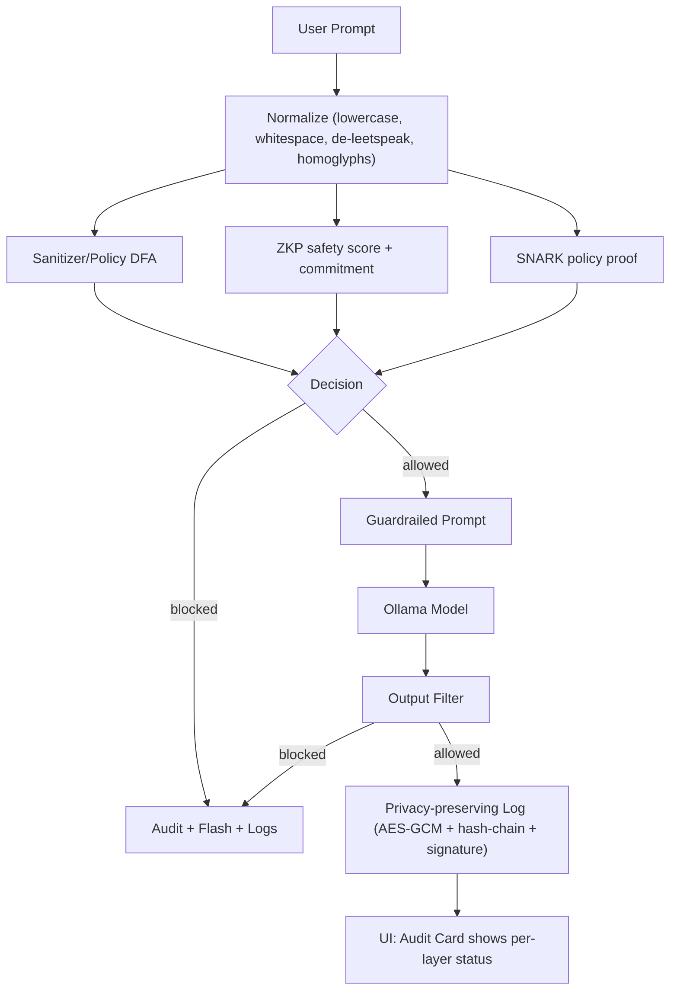
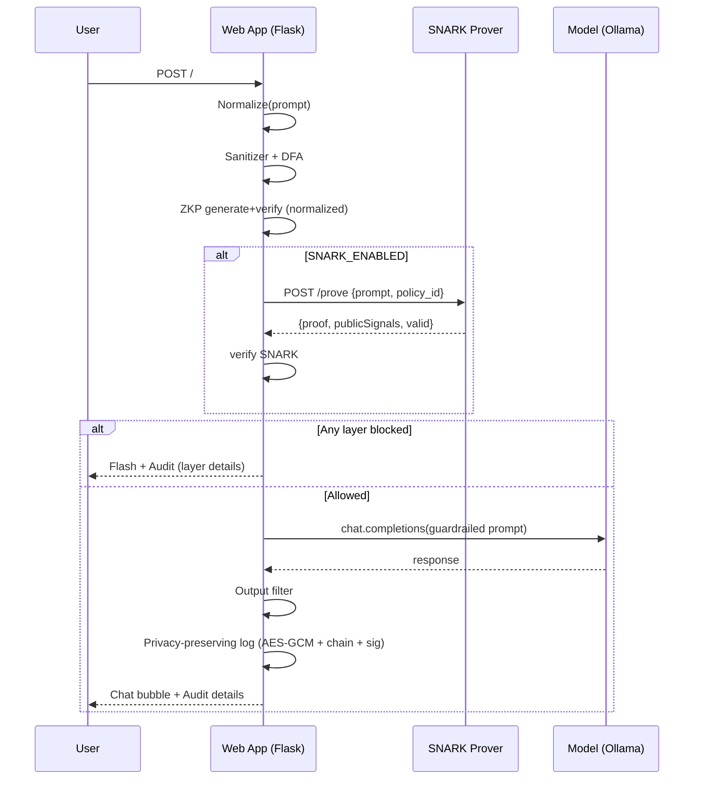
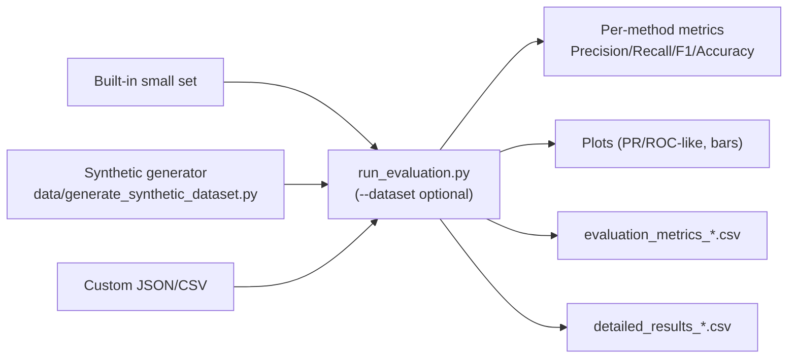
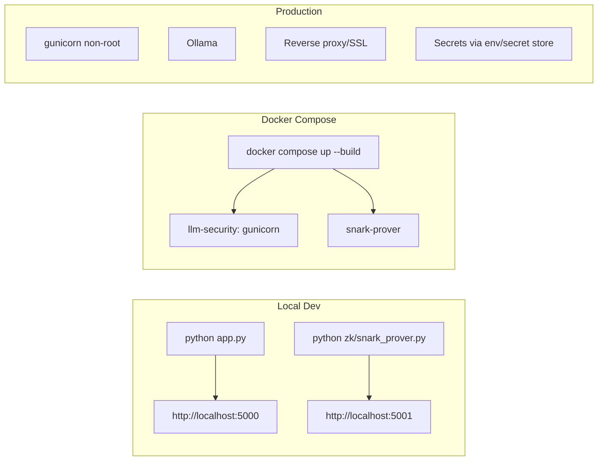
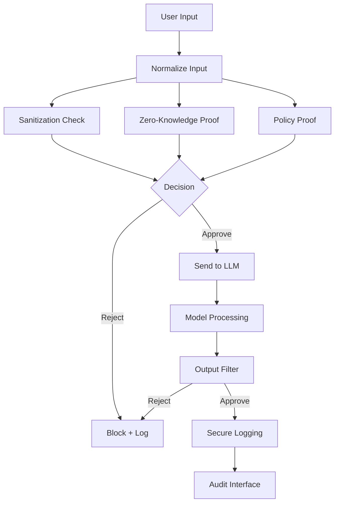

# prompt-injection-mitigation-by-multilayer-cryptographic-security

This project experiments with multi-layer defenses for LLM prompt injection, combining simulated ZK proofs with logging, filtering, and evaluation tooling.

## Quick start
- Install: `pip install -r requirements.txt`
- Generate signing keys: `python generate_keys.py`
- Run app: `python app.py`

## Synthetic dataset
- Generate large datasets to improve accuracy/precision/recall:
  - JSON: `python data/generate_synthetic_dataset.py -b 25000 -a 25000 -f json -o data/synth_50k.json`
  - CSV: `python data/generate_synthetic_dataset.py -b 100000 -a 100000 -f csv -o data/synth_200k.csv`
- Included datasets (ready to use):
  - `data/synth_50k.json` — 50,000 rows (25k benign / 25k adversarial), ~4.8 MB
  - `data/synth_4k.json` — 4,000 rows (balanced), ~0.4 MB
  - `data/synth_200k.csv` — 200,000 rows (100k benign / 100k adversarial), ~12 MB (CSV)
- Schema: `[{"prompt": str, "label": "benign"|"adversarial"}, ...]` (JSON) or CSV columns `prompt,label`

## Evaluation
- Built-in small set: `python run_evaluation.py`
- External datasets:
  - 4k JSON: `python run_evaluation.py -d data/synth_4k.json`
  - 50k JSON: `python run_evaluation.py -d data/synth_50k.json`
  - 200k CSV: `FAST_EVAL=true SKIP_PLOTS=true python run_evaluation.py -d data/synth_200k.csv`
- Outputs include metrics CSV, detailed results CSV, and plots (tagged by dataset name).

- Tips:
  - For large sets (50k/200k) and faster runs: `FAST_EVAL=true SKIP_PLOTS=true ...`
  - To generate figures: ensure matplotlib+seaborn installed, then set `SKIP_PLOTS=false`

### 50k benchmark (synth_50k)
- Summary (from `data/synth_50k.json`):
  - ZKP Framework — Precision 1.000, Recall 0.720, F1 0.837, Accuracy 0.860 (TP 18,010; TN 25,000; FP 0; FN 6,990)
  - Regex Baseline — Precision 1.000, Recall 0.497, F1 0.664, Accuracy 0.749 (TP 12,435; TN 25,000; FP 0; FN 12,565)
  - LLM Simulator — Precision 1.000, Recall 0.496, F1 0.663, Accuracy 0.748 (TP 12,406; TN 25,000; FP 0; FN 12,594)
  - Ensemble — Precision 1.000, Recall 0.795, F1 0.886, Accuracy 0.898 (TP 19,882; TN 25,000; FP 0; FN 5,118)
- Artifacts (example names):
  - `evaluation_metrics_synth_50k_*.csv`, `detailed_results_synth_50k_*.csv`
  - `evaluation_results_synth_50k_*.png` when plots are enabled

Note: Current ZKP implementation is a simulation suitable for research/development and interface testing; not a production cryptographic proof.

## SNARK (simulated) integration
- Start both services with Docker Compose:
```bash
docker compose up --build
```
- The app will call the prover at `http://snark-prover:5001` (see `docker-compose.yml`).
- Local run without Docker:
```bash
# in one terminal
export SNARK_ENABLED=true
export SNARK_PROVER_URL=http://127.0.0.1:5001/prove
export SNARK_VERIFY_URL=http://127.0.0.1:5001/verify
python zk/snark_prover.py

# in another terminal
export SNARK_ENABLED=true
export SNARK_PROVER_URL=http://127.0.0.1:5001/prove
export SNARK_VERIFY_URL=http://127.0.0.1:5001/verify
python app.py
```
- Note: current prover is simulated; replace with real Circom/PLONK prover later.

## Policy and normalization
- Shared normalizer: lowercase, whitespace collapse, de-leetspeak, homoglyph folding; versioned via `NORMALIZER_VERSION`.
- DFA-based policy (trie) loaded via `POLICY_TERMS_PATH` (JSON list). Used inside ZKP safety scoring and can be mirrored in SNARK.

## Security
- CSRF protection enabled on all POST routes; secure cookies (Secure/HttpOnly/SameSite=Lax).
- Persistent AES key for `SecureLogger` via `SECURE_LOGGER_AES_KEY` or `keys/aes.key`.

## Container
- App runs under gunicorn as non-root; healthcheck added.

## Architecture (multilayer: SNARK + ZKP + heuristics)


## Request lifecycle (sequence)


## Evaluation workflow (datasets → metrics)


## Deployment workflows


## Environment variables
- Core
  - OLLAMA_BASE_URL (default http://localhost:11434/v1)
  - OLLAMA_MODEL (default gemma:2b)
  - FLASK_SECRET_KEY
- SNARK
  - SNARK_ENABLED=true|false
  - SNARK_PROVER_URL, SNARK_VERIFY_URL
  - SNARK_POLICY_ID
  - SNARKJS_PATH (optional, for real proving)
  - CIRCUIT_DIR (defaults to zk/build)
- Policy
  - POLICY_TERMS_PATH (JSON list for DFA)
  - NORMALIZER_VERSION (embedded constant in code)
- Logging
  - SECURE_LOGGER_AES_KEY (hex, optional; else keys/aes.key)
- Admin
  - ADMIN_USERNAME, ADMIN_PASSWORD

## Run (local)
```bash
# Terminal 1: SNARK prover (simulated or snarkjs if configured)
export SNARK_ENABLED=true
export SNARK_PROVER_URL=http://127.0.0.1:5001/prove
export SNARK_VERIFY_URL=http://127.0.0.1:5001/verify
python zk/snark_prover.py

# Terminal 2: App
export OLLAMA_BASE_URL=http://localhost:11434/v1
export FLASK_SECRET_KEY=change_me
python app.py
```

## Run (Docker Compose)
```bash
docker compose up --build
```

## Data + evaluation
```bash
# Generate synthetic data (4k)
python data/generate_synthetic_dataset.py -b 2000 -a 2000 -f json -o data/synth_4k.json --seed 42
# Generate synthetic data (50k)
python data/generate_synthetic_dataset.py -b 25000 -a 25000 -f json -o data/synth_50k.json
# Generate synthetic data (200k)
python data/generate_synthetic_dataset.py -b 100000 -a 100000 -f csv -o data/synth_200k.csv

# Evaluate (built-in)
python run_evaluation.py
# Evaluate (4k)
python run_evaluation.py -d data/synth_4k.json
# Evaluate (50k)
python run_evaluation.py -d data/synth_50k.json
# Evaluate (200k)
FAST_EVAL=true SKIP_PLOTS=true python run_evaluation.py -d data/synth_200k.csv
```

## Security hardening summary
- CSRF protection on all POST routes; secure cookies (Secure/HttpOnly/SameSite)
- Hashed users in SQLite (default admin via env); remove default creds in prod
- Persistent AES key; hash‑chain + signature verification fixed
- Timeouts for LLM calls; env‑configurable models and base URL

## Guarantees and limits
- Cryptographic
  - ZKP: integrity of safety scoring and commitment on the normalized prompt
  - SNARK: policy compliance without revealing the prompt (when using real circuit)
  - Logs: tamper‑evident, privacy‑preserving
- Heuristics: sanitizer/DFA, output filter, LLM self‑check—measured, not proven
- Limits: policy incompleteness, semantic/indirect attacks, trusted setup, perf

## Roadmap
- Replace simulated SNARK with Circom/PLONK flow (zk/circom/policy.circom)
- DFA/token set expansion + semantic classifiers
- Auto threshold tuner and per‑layer PR/ROC reporting
- CI + non‑root containers + healthchecks (done) and staging pipelines

## Mathematical foundations (concise)
### Commitment on normalized prompt
- Let raw prompt be `x` and normalized prompt be `x̃ = normalize(x)`. We sample a nonce `r`.
- Commitment: `c = H(x̃ || r)`

### Challenge (binds rules and time)
- Let `R` be the sorted list of safety rules.
- Challenge: `ch = H(c || H(json(R)) || t)`

### Response (metadata integrity)
- With metadata `m = {len, s, |R|, t, v_N}`, where `s` is the safety score and `v_N` the normalizer version:
- Response: `ρ = H(json(m))`

### Verification checks
- Freshness: `|now - t| ≤ Δ_T` (e.g., 300 s)
- Challenge consistency: `ch ?= H(c || H(json(R)) || t)`
- Threshold: `s ≥ τ`, where `τ = ZKP_MIN_SCORE`

### Heuristic safety score
- DFA term match indicator: `𝟙_DFA(x̃)`
- Risk pattern indicators: `𝟙_i(x̃)`
- Cross-signals: `𝟙_j(x̃)`
- Score: `s = max(0, 1 - α𝟙_DFA - Σβ_i𝟙_i - Σγ_j𝟙_j)`

### SNARK (optional)
- `Verify(vk, π, pub) ∈ {true, false}` for policy compliance on `x̃`

### Privacy-preserving log
- For interaction i with commitments `cⁱ_p, cⁱ_r` and previous hash `h_{i-1}`:
- `h_i = H(cⁱ_p || cⁱ_r || h_{i-1})`
- `σ_i = Sign_sk(h_i)`
- 
## Detailed stage-by-stage flow (how it works)



### Stage semantics
1. Normalize: lowercase, de-leetspeak, homoglyph folding, whitespace collapse.
2. Sanitizer/DFA: fast pattern/phrase checks; DFA uses precise terms with boundary safeguards.
3. ZKP: compute commitment, challenge, metadata (safety score s), and verify \(s\ge \tau\).
4. SNARK (optional): remote/local proof for policy compliance.
5. Decision: block on any failing layer (or stricter policy in strict mode); otherwise continue.
6. Guardrail prompt: prepend safety prefix.
7. Model call: bounded timeouts; configurable base URL/model.
8. Output filter: block sensitive tokens/structures.
9. Log: AES-GCM encryption, hash chaining, Ed25519 signature.

## Metrics (definitions)
- Accuracy: \( \frac{TP+TN}{TP+TN+FP+FN} \)
- Precision: \( \frac{TP}{TP+FP} \)
- Recall: \( \frac{TP}{TP+FN} \)
- F1: \( 2\cdot\frac{\mathrm{Prec}\cdot\mathrm{Rec}}{\mathrm{Prec}+\mathrm{Rec}} \)

## Evaluation recipes (reproducible)
- Generate 4k dataset (balanced):
```bash
python data/generate_synthetic_dataset.py -b 2000 -a 2000 -f json -o data/synth_4k.json --seed 42
```
- Run fast (no plots):
```bash
FAST_EVAL=true SKIP_PLOTS=true python run_evaluation.py -d data/synth_4k.json
```
- Run with figures (install numpy+pandas+sklearn+matplotlib+seaborn; headless: set MPLBACKEND=Agg):
```bash
SKIP_PLOTS=false python run_evaluation.py -d data/synth_4k.json
```

## Tuning knobs (practical)
- Thresholds: \(\tau=\) `ZKP_MIN_SCORE` (default 0.6)
- DFA terms: set `POLICY_TERMS_PATH` to a JSON list of precise phrases (normalized, lowercase)
- Strict mode: toggles LLM self-check gating in the UI
- Transformer: `ENABLE_TRANSFORMER=true` (falls back heuristically if not installed)

## Threat model vs guarantees (summary)
- Guarantees: commitment integrity on normalized prompts; thresholded safety scoring; optional policy SNARK; tamper-evident logging.
- Non-goals: perfect semantic understanding; zero false negatives under heavy obfuscation; trusted-setup caveats for SNARK (if used).
