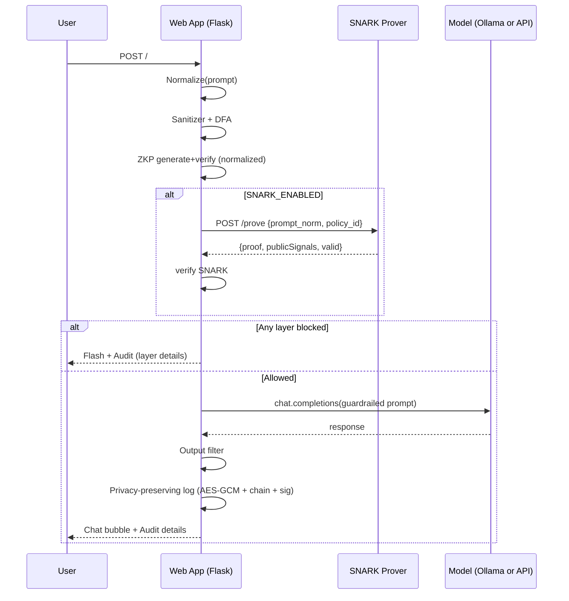

## ZKP-Augmented LLM Security: Multi-Layer Adversarial Prompt Protection with Privacy-Preserving Audit Trails

### Abstract
Large Language Models (LLMs) are highly susceptible to adversarial prompts (aka prompt injection), where carefully crafted instructions manipulate model behavior, extract secrets, or bypass safety filters. This project proposes and implements a practical, end-to-end, multi-layer security framework that combines fast heuristics with cryptographic assurances. The core novelty is a Zero-Knowledge Proof (ZKP)-augmented pipeline that produces privacy-preserving, tamper-evident audit trails while deterministically enforcing layered defenses before, during, and after generation.

### Problem Statement (What is being solved)
- LLMs can be coerced to ignore safety policies through prompt injection, jailbreaks, and obfuscated attacks.
- Organizations need reproducible, auditable guarantees that prompts were checked, scored, and handled under a consistent policy—without exposing sensitive prompt content in logs or telemetry.
- Security teams need measurable, repeatable evaluation with clear metrics and plots to compare multiple detection strategies under realistic datasets.

### Contributions (Proposed Solution)
This system provides a production-oriented blueprint that implements:
- Deterministic, multi-layer defenses aligned to the LLM request lifecycle
- ZKP-based safety scoring, commitment, and verification
- Optional SNARK policy proofing (simulated by default; real circuit ready)
- Privacy-preserving logs: AES-GCM encryption + hash-chain + digital signatures
- Repeatable evaluation harness with metrics and plots

The result is a traceable, defense-in-depth pipeline with cryptographic accountability, measurable detection quality, and clear auditability.

### Novelty and Uniqueness (What makes this work different)
- Cryptographic accountability for prompt safety: safety scoring is bound to a normalized prompt via commitments and ZK proofs, enabling verifiable, privacy-preserving audits.
- Multi-layer composition with explicit data flow: normalizer → pattern/DFA → ZKP → optional SNARK → guardrails → output filter → encrypted, chained logs. This reduces single-point failure and clarifies responsibility per layer.
- Privacy-preserving audit trails: logs include proof IDs, normalizer version, timings, and signatures, but never expose raw prompts; auditors can verify integrity without access to secrets.
- Evaluation built in: a consistent pipeline that compares multiple detectors with guaranteed plots (headless safe) to reason about accuracy, precision/recall, F1, specificity, and latency.
- Swap-in cryptography: the SNARK service runs simulated proofs by default but can be pointed at real circuits (snarkjs) without changing the application contract.

## System Overview

### Architecture (high-level)
```mermaid
flowchart TD
    A[User Prompt] --> N["Normalize (lowercase, whitespace, de‑leetspeak, homoglyph fold)"]
    N --> S[Sanitizer/Policy DFA]
    N --> Z[ZKP safety score + commitment + verify]
    N --> K[SNARK policy proof (optional)]
    S --> D{Decision}
    Z --> D
    K --> D
    D -->|blocked| B[Audit + Flash + Logs]
    D -->|allowed| G[Guardrailed Prompt]
    G --> LLM[Model]
    LLM --> OF[Output Filter]
    OF -->|blocked| B
    OF -->|allowed| LOG["Privacy‑preserving Log (AES‑GCM + hash‑chain + signature)"]
    LOG --> UI["UI: Audit Card per-layer status"]
```

### Request Lifecycle (sequence)

```mermaid
sequenceDiagram
  participant U as User
  participant W as Web App (Flask)
  participant P as SNARK Prover
  participant M as Model (Ollama or API)
  U->>W: POST /
  W->>W: Normalize(prompt)
  W->>W: Sanitizer + DFA
  W->>W: ZKP generate+verify (normalized)
  alt SNARK_ENABLED
    W->>P: POST /prove {prompt_norm, policy_id}
    P-->>W: {proof, publicSignals, valid}
    W->>W: verify SNARK
  end
  alt Any layer blocked
    W-->>U: Flash + Audit (layer details)
  else Allowed
    W->>M: chat.completions(guardrailed prompt)
    M-->>W: response
    W->>W: Output filter
    W->>W: Privacy‑preserving log (AES‑GCM + chain + sig)
    W-->>U: Chat bubble + Audit details
  end
```

## Layers (What the solution consists of)
Each layer is independent and composable. Blocking occurs on first failing layer (strict mode can enforce stricter logic).

- Normalizer (versioned)
  - Lowercase, whitespace collapse, leetspeak de‑obfuscation, homoglyph folding
  - Versioned via `NORMALIZER_VERSION`; ensures proofs and logs bind to the same canonical text

- Sanitizer / DFA policy
  - Fast pattern checks for known high‑risk phrases (e.g., “ignore previous instructions”, “admin password”)
  - Deterministic guard against common, direct injections

- ZKP Safety Scoring + Commitment (Core)
  - Generate a commitment to the normalized prompt and a proof of safety score ≥ threshold
  - Verify proof server‑side before any model call
  - Records include proof id and safety metadata for audit without revealing the raw prompt

- SNARK Policy Proof (Optional; simulated by default)
  - Independent policy compliance proof. When enabled, the app will call a prover service and verify the result
  - Thresholds and policy id are configurable; real circuits can replace the simulated path

- LLM Self‑Check (advisory or blocking in strict mode)
  - Lightweight, model‑based “sanity” check to catch semantic or indirect attacks

- Output Filter
  - Post‑generation guard that blocks sensitive tokens or structures in the model’s response

- Privacy‑Preserving Logging (Audit Trails)
  - Encrypt interaction data via AES‑GCM; hash‑chain each record for tamper‑evidence; sign with Ed25519
  - The audit card shows per‑layer status, proof IDs, normalizer version, and timings without revealing secrets

## Cryptographic Guarantees (concise)
- ZKP: Integrity of safety scoring and binding to normalized prompt via commitments
- SNARK (optional): Policy compliance without exposing the prompt
- Logs: Confidentiality (AES‑GCM), tamper‑evidence (hash chain), non‑repudiation (signature)

## Datasets
- Included in this repo:
  - `data/4kdata.csv` and `data/4kdata.json` — balanced, small dataset
  - `data/50kdata.csv` and `data/50kdata.json` — medium dataset
  - `data/kaggle_dataset.csv` — sample placeholder; replace with your real Kaggle conversion
- Generate larger dataset locally (not stored in Git due to size):
```bash
python data/generate_dataset.py -b 100000 -a 100000 -f csv -o data/200kdata.csv
```

### Data generation
```bash
# 4k JSON
python data/generate_dataset.py -b 2000 -a 2000 -f json -o data/4kdata.json --seed 42
# 50k JSON
python data/generate_dataset.py -b 25000 -a 25000 -f json -o data/50kdata.json
# 200k CSV (local generation)
python data/generate_dataset.py -b 100000 -a 100000 -f csv -o data/200kdata.csv
```

### Kaggle integration (optional)
```bash
# Requires kaggle CLI authenticated via KAGGLE_USERNAME/KAGGLE_KEY
tools/fetch_kaggle_dataset.sh <user/dataset-slug> kaggle_dataset.jsonl data/kaggle_dataset.csv

# Or convert an already-downloaded JSONL to CSV (prompt,label):
python tools/convert_jsonl_to_csv.py -i data/kaggle_dataset.jsonl -o data/kaggle_dataset.csv --lowercase-label
```

## Running the System (functional overview)
### App (local)
```bash
pip install -r requirements.txt
python generate_keys.py
python app.py
```
Open the UI and test prompts. The audit card shows per‑layer status and timings. Use strict mode to block on any failing layer.

### LLM Integration (Ollama and model options)
This project speaks to LLMs via an OpenAI-compatible API (default points to Ollama). Configure at runtime using environment variables.

Supported local models with Ollama (examples):
```bash
# in a separate terminal
ollama serve
ollama pull llama2:7b
ollama pull tinyllama:1.1b
ollama pull mistral:7b-instruct
ollama pull gemma:2b

# run the app with Ollama endpoint
export OLLAMA_BASE_URL=http://localhost:11434/v1
export OLLAMA_MODEL=gemma:2b
python app.py
```

Communication flow with LLMs:
- The app validates prompts through the security layers before making a chat.completions call.
- Allowed prompts are guardrailed (prefix instructions), then sent to the LLM over HTTP.
- Responses are post-filtered and logged via ZKP-backed privacy-preserving logging.

Inference and training context:
- This project focuses on inference-time defenses (pre- and post-LLM gates). No model training is required.
- Optional semantic classifier (TF-IDF + LR) can be trained on project datasets for additional detection signals.
- Transformer-based classifier (e.g., distilroberta) can be enabled via env (`ENABLE_TRANSFORMER=true`) for semantic coverage; used strictly as an additional detector, not as the generative model.

Security posture for LLM connectivity:
- Never send raw prompts to third-party telemetry.
- Normalize and inspect prompts locally; ZKP/SNARK decisions run locally (SNARK prover can be local or remote per env).
- All logs are encrypted at rest (AES-GCM), chained, and signed to detect tampering.

### Optional: SNARK service (simulated or snarkjs if configured)
```bash
export SNARK_ENABLED=true
export SNARK_PROVER_URL=http://127.0.0.1:5001/prove
export SNARK_VERIFY_URL=http://127.0.0.1:5001/verify
python zk/snark_prover.py
```

## Evaluation (clear metrics and guaranteed plots)

### What we measure
- Accuracy: fraction of correct classifications
- Precision: TP / (TP + FP)
- Recall (Sensitivity): TP / (TP + FN)
- F1: harmonic mean of precision and recall
- Specificity: TN / (TN + FP)
- Average Detection Time (ms): mean per‑prompt latency per method

### How to run
```bash
# Ensure plotting is enabled (Agg backend is used for headless)
FAST_EVAL=true SKIP_PLOTS=false python run_evaluation.py -d data/4kdata.csv -o results
```
Outputs under `results/`:
- `performance_metrics.png` — accuracy/precision/recall/F1 across methods
- `confusion_matrix.png` — confusion matrix for the ZKP layer
- `latency_comparison.png` — average detection time per method
- `metrics_<timestamp>.csv` — numeric metrics per method

Reproducibility considerations:
- We fix the matplotlib backend to Agg to support headless servers.
- The evaluation runner gracefully degrades when pandas/seaborn are not installed, using pure-matplotlib paths.
- Datasets included (4k/50k) are versioned in repo; 200k must be generated locally to avoid repository bloat.
- Seeded data generation allows controlled variance (via `--seed`) for robust experimentation.

### Methods compared
- ZKP Framework (this project’s core layer)
- Regex Baseline (extended sanitizer)
- LLM Simulator (risk‑factor heuristic)
- Ensemble (weighted voting)
- Optional transformer (if enabled via env)

## Diagrams explained (how it works)
- Architecture graph: shows the data flow and where each layer attaches. Normalization ensures all downstream checks use the same canonical text. ZKP/SNARK gates prevent unsafe prompts from reaching the model. Output filter and audit trails protect the final mile.
- Sequence diagram: highlights control flow and branching. The SNARK branch only runs if enabled; otherwise ZKP + sanitizer enforce minimal blocking policy. The log step seals an immutable, privacy‑preserving audit record.
- Evaluation workflow (internal to code): pipeline evaluates multiple detectors against the same dataset, aggregates metrics, and renders plots to compare trade‑offs.

## Threat Model (concise)
- Attacks: direct injections, obfuscation (leetspeak, homoglyphs), roleplay, indirect prompts, exfiltration patterns
- Defenses: normalizer + DFA + ZKP + optional SNARK + output filtering + audit logging
- Out‑of‑scope: perfect semantic understanding and zero false negatives under unrestricted attacker effort

## Limitations and Future Work
- Real SNARK circuits can replace the simulated path. The service endpoints and environment variables are already wired.
- Transformer‑based classifiers can be enabled for improved semantic coverage.
- Policy and DFA expansions, adaptive thresholds, and per‑layer ROC/PR curves are recommended for production hardening.

## Environment Variables (selected)
- Core
  - `FLASK_SECRET_KEY`, `OLLAMA_BASE_URL`, `OLLAMA_MODEL`
- ZK / SNARK
  - `ZKP_THRESHOLD`, `SNARK_ENABLED`, `SNARK_PROVER_URL`, `SNARK_VERIFY_URL`, `SNARK_POLICY_ID`, `SNARK_THRESHOLD`
- Logging/Audit
  - `SECURE_LOGGER_AES_KEY` (hex) or use `keys/aes.key`
- Evaluation
  - `FAST_EVAL` (true/false), `SKIP_PLOTS` (true/false), `ENABLE_TRANSFORMER`

## File Map (key components)
- `app.py` — web app, layer orchestration, audit UI
- `zkp_security.py` — ZKP safety proofing and SNARK integration hooks
- `security/` — sanitizer, output filter, semantic tools
- `data/generate_dataset.py` — dataset generator
- `tools/convert_jsonl_to_csv.py` — convert JSONL to CSV
- `tools/fetch_kaggle_dataset.sh` — fetch and convert Kaggle JSONL
- `run_evaluation.py` — fixed evaluation runner with guaranteed plots

## Citation (project/paper title)
ZKP‑Augmented LLM Security: Multi‑Layer Adversarial Prompt Protection with Privacy‑Preserving Audit Trails

### Kaggle dataset (optional)
- If you have a Kaggle JSONL (e.g., `kaggle_dataset.jsonl`), you can fetch and convert it to CSV with:
```bash
# Requires kaggle CLI authenticated via KAGGLE_USERNAME/KAGGLE_KEY
tools/fetch_kaggle_dataset.sh <user/dataset-slug> kaggle_dataset.jsonl data/kaggle_dataset.csv
# Or convert an already-downloaded JSONL to CSV (prompt,label):
python tools/convert_jsonl_to_csv.py -i data/kaggle_dataset.jsonl -o data/kaggle_dataset.csv --lowercase-label
```