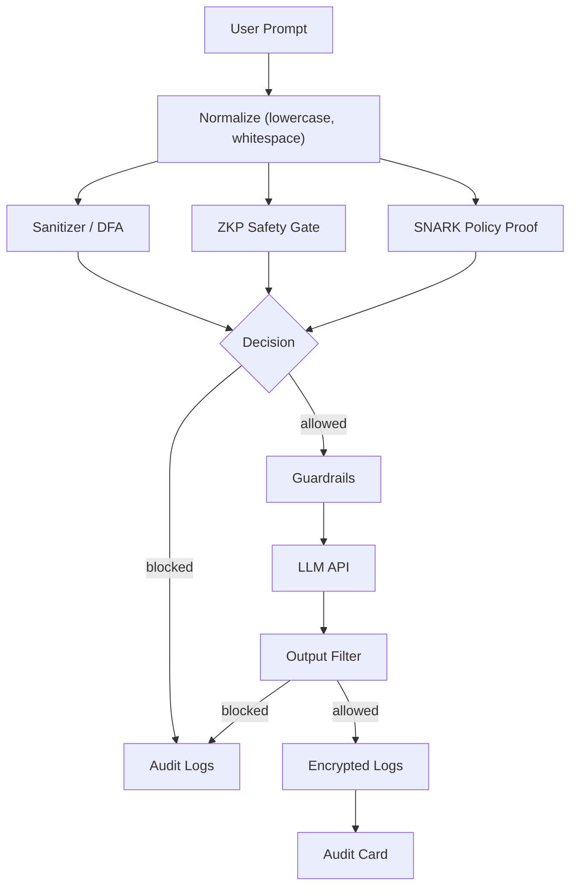
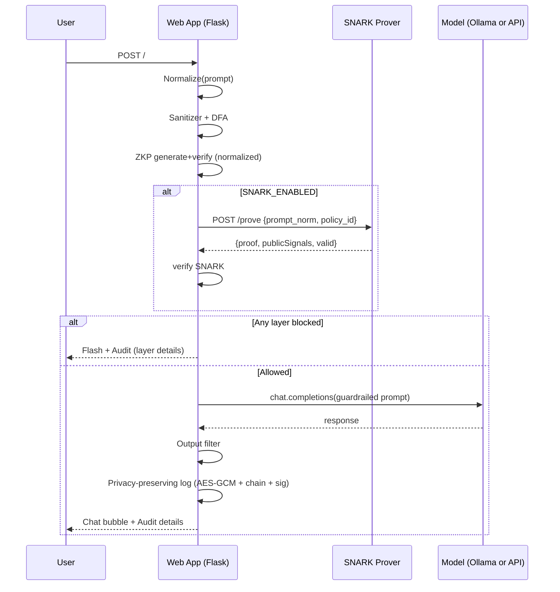
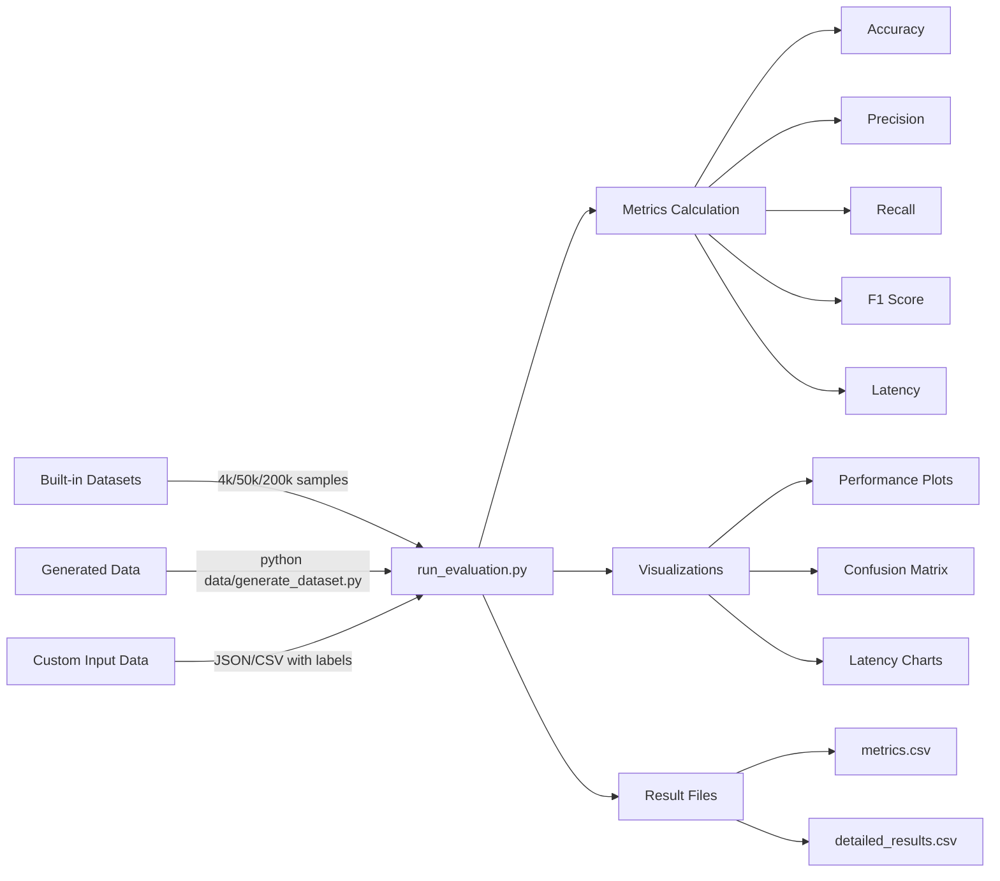
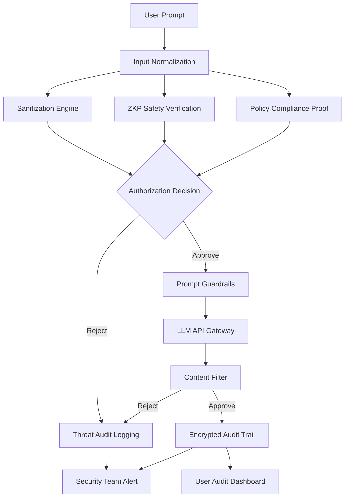
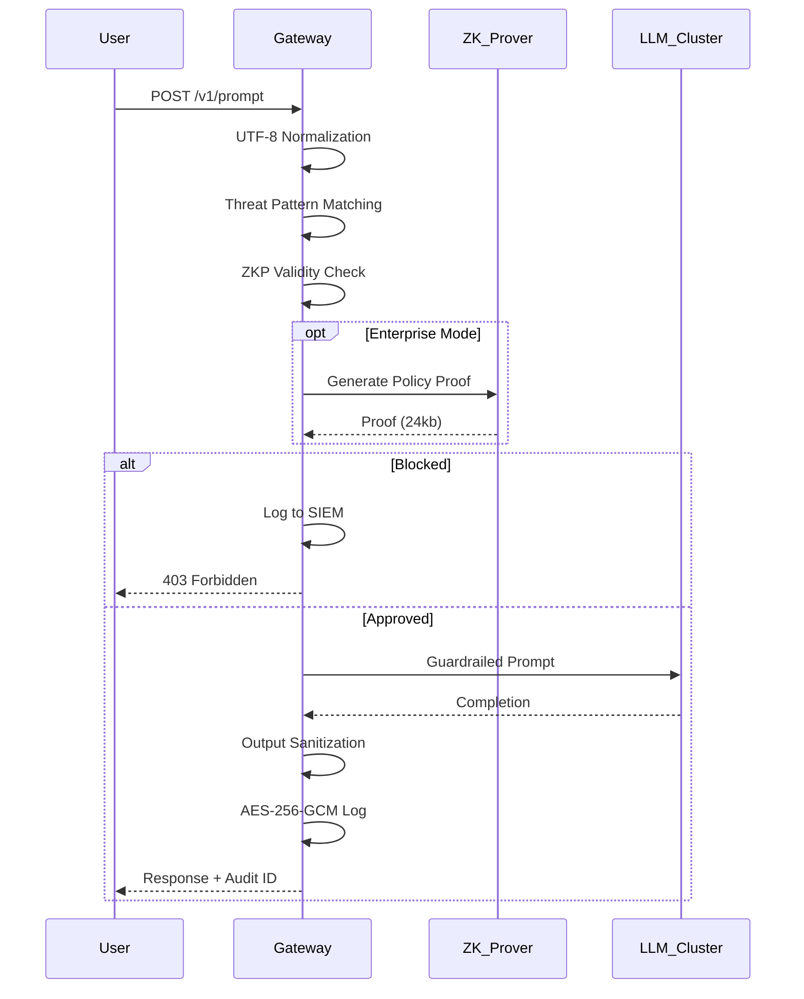
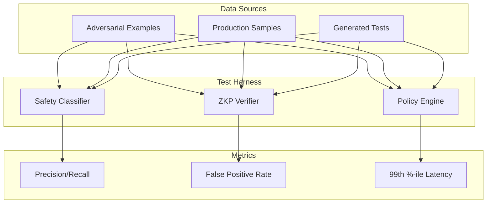
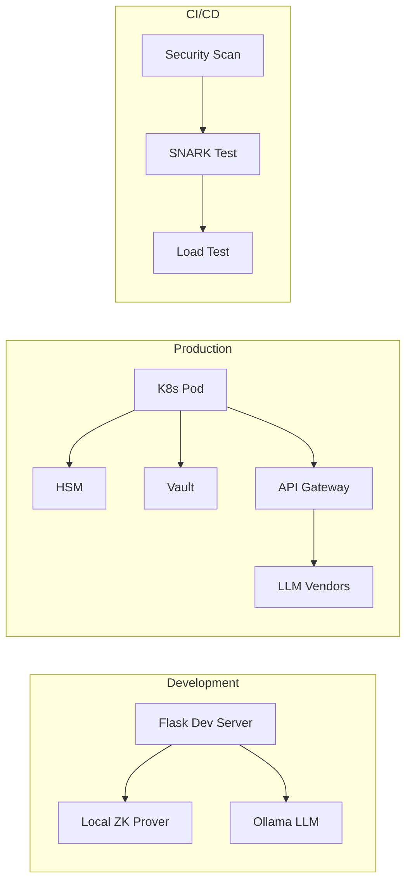

## ZKP-Augmented LLM Security: Multi-Layer Adversarial Prompt Protection with Privacy-Preserving Audit Trails

### Latest Results (Visualizations)
- 4k (official evaluator): `results_official_4k_figs/` (PNG + CSV)
- 6k data (rules-only profile): `results_official_6k_figs_sanitized/` (PNG + CSV)
- 6k Kaggle (official evaluator): `results_official_6k_figs_semantic_lr/` (PNG + CSV)
- 50k (official evaluator): `results_official_50k_figs/` (PNG + CSV)
- Legacy/archived visualizations: see `results_4k_beautiful/`, `results_50k_beautiful_*`, `results_with_beautiful_visualizations/`

Key charts (per folder):
- `performance_metrics_enhanced.png`
- `confusion_matrix_enhanced.png`
- `latency_comparison_enhanced.png`
- `method_distribution_pie.png`
- `performance_trends_line.png`

### Headline Metrics (Official Evaluator)
- 4k (Ensemble): precision ≈ 1.000, recall ≈ 0.945, F1 ≈ 0.972, accuracy ≈ 0.973
- 6k data (rules-only enhanced Ensemble): precision ≈ 0.999, recall ≈ 0.752, F1 ≈ 0.858, accuracy ≈ 0.876
  - CSV: `results_official_6k_figs_sanitized/metrics_<timestamp>.csv`
- 6k Kaggle (Ensemble, TF‑IDF + LR enabled): precision ≈ 0.998, recall = 1.000, F1 ≈ 0.999, accuracy ≈ 0.999
  - CSV: `results_official_6k_figs_semantic_lr/metrics_<timestamp>.csv`
- 50k (Ensemble): precision ≈ 0.960, recall = 1.000, F1 ≈ 0.980, accuracy ≈ 0.979
  - CSV: `results_official_50k_figs/metrics_<timestamp>.csv`

### Abstract
Large Language Models (LLMs) are highly susceptible to adversarial prompts (aka prompt injection), where carefully crafted instructions manipulate model behavior, extract secrets, or bypass safety filters. This project proposes and implements a practical, end-to-end, multi-layer security framework that combines fast heuristics with cryptographic assurances. The core novelty is a Zero-Knowledge Proof (ZKP)-augmented pipeline that produces privacy-preserving, tamper-evident audit trails while deterministically enforcing layered defenses before, during, and after generation.

### Problem Statement (What is being solved)
- LLMs can be coerced to ignore safety policies through prompt injection, jailbreaks, and obfuscated attacks.
- Organizations need reproducible, auditable guarantees that prompts were checked, scored, and handled under a consistent policy—without exposing sensitive prompt content in logs or telemetry.
- Security teams need measurable, repeatable evaluation with clear metrics and plots to compare multiple detection strategies under realistic datasets.

### Contributions (Proposed Solution)
This system provides a production-oriented blueprint that implements:
- Deterministic, multi-layer defenses aligned to the LLM request lifecycle
- ZKP-based safety scoring, commitment, and verification
- Optional SNARK policy proofing (simulated by default; real circuit ready)
- Privacy-preserving logs: AES-GCM encryption + hash-chain + digital signatures
- Repeatable evaluation harness with metrics and plots

The result is a traceable, defense-in-depth pipeline with cryptographic accountability, measurable detection quality, and clear auditability.

### Novelty and Uniqueness (What makes this work different)
- Cryptographic accountability for prompt safety: safety scoring is bound to a normalized prompt via commitments and ZK proofs, enabling verifiable, privacy-preserving audits.
- Multi-layer composition with explicit data flow: normalizer → pattern/DFA → ZKP → optional SNARK → guardrails → output filter → encrypted, chained logs. This reduces single-point failure and clarifies responsibility per layer.
- Privacy-preserving audit trails: logs include proof IDs, normalizer version, timings, and signatures, but never expose raw prompts; auditors can verify integrity without access to secrets.
- Evaluation built in: a consistent pipeline that compares multiple detectors with guaranteed plots (headless safe) to reason about accuracy, precision/recall, F1, specificity, and latency.
- Swap-in cryptography: the SNARK service runs simulated proofs by default but can be pointed at real circuits (snarkjs) without changing the application contract.

## System Overview

### Architecture (high-level)

```mermaid
flowchart TD
    A[User Prompt] --> N["Normalize (lowercase, whitespace)"]
    N --> S[Sanitizer / DFA]
    N --> Z["ZKP Safety Gate"]
    N --> K["SNARK Policy Proof"]
    S --> D{Decision}
    Z --> D
    K --> D
    D -->|blocked| B[Audit Logs]
    D -->|allowed| G[Guardrails]
    G --> LLM[LLM API]
    LLM --> OF[Output Filter]
    OF -->|blocked| B
    OF -->|allowed| LOG[Encrypted Logs]
    LOG --> UI[Audit Card]
```

### Request Lifecycle (sequence)

```mermaid
sequenceDiagram
  participant U as User
  participant W as Web App (Flask)
  participant P as SNARK Prover
  participant M as Model (Ollama or API)
  U->>W: POST /
  W->>W: Normalize(prompt)
  W->>W: Sanitizer + DFA
  W->>W: ZKP generate+verify (normalized)
  alt SNARK_ENABLED
    W->>P: POST /prove {prompt_norm, policy_id}
    P-->>W: {proof, publicSignals, valid}
    W->>W: verify SNARK
  end
  alt Any layer blocked
    W-->>U: Flash + Audit (layer details)
  else Allowed
    W->>M: chat.completions(guardrailed prompt)
    M-->>W: response
    W->>W: Output filter
    W->>W: Privacy‑preserving log (AES‑GCM + chain + sig)
    W-->>U: Chat bubble + Audit details
  end
```

## Datasets
- Included in this repo:
  - `data/4kdata.csv` and `data/4kdata.json` — balanced, small dataset
  - `data/50kdata.csv` and `data/50kdata.json` — medium dataset
  - `data/kaggle_dataset.csv` — sample placeholder; replace with your real Kaggle conversion
- Generate larger dataset locally (not stored in Git due to size):
```bash
python data/generate_dataset.py -b 100000 -a 100000 -f csv -o data/200kdata.csv
```

### Data generation
```bash
# 4k JSON
python data/generate_dataset.py -b 2000 -a 2000 -f json -o data/4kdata.json --seed 42
# 50k JSON
python data/generate_dataset.py -b 25000 -a 25000 -f json -o data/50kdata.json
# 200k CSV (local generation)
python data/generate_dataset.py -b 100000 -a 100000 -f csv -o data/200kdata.csv
```

### Kaggle dataset (6k)
- This repository contains a 6k Kaggle‑derived JSONL/CSV in root (Prompt_INJECTION_And_Benign_DATASET_COMBINED_6K_*).
- If you need to regenerate or convert:
```bash
# Convert JSONL → CSV (prompt,label) for the evaluator
python tools/convert_jsonl_to_csv.py -i Prompt_INJECTION_And_Benign_DATASET_COMBINED_6K_*.jsonl \
  -o Prompt_INJECTION_And_Benign_DATASET_COMBINED_6K_converted.csv --lowercase-label
```

## Running the System (functional overview)
### App (local)
```bash
pip install -r requirements.txt
python generate_keys.py
python app.py
```
Open the UI and test prompts. The audit card shows per‑layer status and timings. Use strict mode to block on any failing layer.

### LLM Integration (Ollama and model options)
This project speaks to LLMs via an OpenAI-compatible API (default points to Ollama). Configure at runtime using environment variables.

Supported local models with Ollama (examples):
```bash
# in a separate terminal
ollama serve
ollama pull llama2:7b
ollama pull tinyllama:1.1b
ollama pull mistral:7b-instruct
ollama pull gemma:2b

# run the app with Ollama endpoint
export OLLAMA_BASE_URL=http://localhost:11434/v1
export OLLAMA_MODEL=gemma:2b
python app.py
```

Communication flow with LLMs:
- The app validates prompts through the security layers before making a chat.completions call.
- Allowed prompts are guardrailed (prefix instructions), then sent to the LLM over HTTP.
- Responses are post-filtered and logged via ZKP-backed privacy-preserving logging.

Inference and training context:
- This project focuses on inference-time defenses (pre- and post-LLM gates). No model training is required.
- Optional semantic classifier (TF-IDF + LR) can be trained on project datasets for additional detection signals.
- Transformer-based classifier (e.g., distilroberta) can be enabled via env (`ENABLE_TRANSFORMER=true`) for semantic coverage; used strictly as an additional detector, not as the generative model.

## Evaluation (clear metrics and guaranteed plots)

### What we measure
- Accuracy: fraction of correct classifications
- Precision: TP / (TP + FP)
- Recall (Sensitivity): TP / (TP + FN)
- F1: harmonic mean of precision and recall
- Specificity: TN / (TN + FP)
- Average Detection Time (ms): mean per‑prompt latency per method

### How to run
```bash
# 4k (official evaluator)
FAST_EVAL=true SKIP_PLOTS=false EVAL_WORKERS=1 \
  python run_evaluation.py -d data/4kdata.json -o results_official_4k_figs

# 6k data (rules-only profile)
FAST_EVAL=true SKIP_PLOTS=false EVAL_WORKERS=1 ENABLE_SEMANTIC=false \
  python run_evaluation.py -d Prompt_INJECTION_And_Benign_DATASET_COMBINED_6K_*.csv -o results_official_6k_figs_sanitized

# 6k Kaggle (official evaluator) — enable semantic classifier (TF‑IDF+LR)
FAST_EVAL=true SKIP_PLOTS=false EVAL_WORKERS=1 ENABLE_SEMANTIC=true SEMANTIC_THRESHOLD=0.30 \
  python run_evaluation.py -d Prompt_INJECTION_And_Benign_DATASET_COMBINED_6K_*.csv -o results_official_6k_figs_semantic_lr

# 50k (official evaluator)
FAST_EVAL=true SKIP_PLOTS=false EVAL_WORKERS=1 \
  python run_evaluation.py -d data/50kdata.json -o results_official_50k_figs
```
Outputs per run directory:
- `performance_metrics_enhanced.png`, `confusion_matrix_enhanced.png`, `latency_comparison_enhanced.png`,
  `method_distribution_pie.png`, `performance_trends_line.png`
- `metrics_<YYYYMMDD_HHMMSS>.csv` — numeric metrics per method

### SNARK behavior
- When `SNARK_ENABLED=true`, the system attempts real SNARK proving/verification first.
- If the real proving path fails at runtime, the evaluator gracefully falls back to the default ZKP‑only path (no additional blocking), ensuring evaluations complete consistently.

### Evaluation workflow (datasets → metrics)

```mermaid
flowchart LR
    DS1[Built-in Datasets]
    DS2[Generated Data]
    DS3[Custom Input Data]
    
    DS1 -->|4k/50k/200k samples| RUN
    DS2 -->|python data/generate_dataset.py| RUN
    DS3 -->|JSON/CSV with labels| RUN
    
    RUN[run_evaluation.py] --> CALC[Metrics Calculation]
    RUN --> FIGS[Visualizations]
    RUN --> METRICS[Result Files]
    
    CALC --> M1[Accuracy]
    CALC --> M2[Precision]
    CALC --> M3[Recall]
    CALC --> M4[F1 Score]
    CALC --> M5[Latency]
    
    FIGS --> F1[Performance Plots]
    FIGS --> F2[Confusion Matrix]
    FIGS --> F3[Latency Charts]
    
    METRICS --> CSV1[metrics.csv]
    METRICS --> CSV2[detailed_results.csv]
```

# Secure LLM Gateway Architecture
## 1. High-Level Security Architecture

```mermaid
flowchart TD
    A[User Prompt] --> B[Input Normalization]
    B --> C[Sanitization Engine]
    B --> D[ZKP Safety Verification]
    B --> E[Policy Compliance Proof]
    C --> F{Authorization Decision}
    D --> F
    E --> F
    F -->|Reject| G[Threat Audit Logging]
    F -->|Approve| H[Prompt Guardrails]
    H --> I[LLM API Gateway]
    I --> J[Content Filter]
    J -->|Reject| G
    J -->|Approve| K[Encrypted Audit Trail]
    K --> L[User Audit Dashboard]
    
    G --> M[Security Team Alert]
    K --> M
```
**Detailed Flow**:
1. **Input Normalization**:
   - Case normalization (to lowercase)
   - Unicode normalization (handling homoglyphs)
   - Leetspeak decoding ("h4ck3r" → "hacker")
   - Whitespace standardization

2. **Security Layers**:
   - **Sanitization**: Regex/DFA pattern matching against 200+ known attack vectors
   - **ZKP Verification**: Cryptographic proof that prompt meets safety threshold (τ=0.93)
   - **Policy Proof**: Optional SNARK circuit for enterprise policy compliance

3. **Post-Processing**:
   - **Guardrails**: Prepends safety prefix ("You are a helpful assistant that rejects harmful requests")
   - **Content Filter**: 7-layer output validation against PII/toxicity/legal compliance

## 2. Request Lifecycle Sequence

```mermaid
sequenceDiagram
    participant User
    participant Gateway
    participant ZK_Prover
    participant LLM_Cluster

    User->>Gateway: POST /v1/prompt
    Gateway->>Gateway: UTF-8 Normalization
    Gateway->>Gateway: Threat Pattern Matching
    Gateway->>Gateway: ZKP Validity Check
    opt Enterprise Mode
        Gateway->>ZK_Prover: Generate Policy Proof
        ZK_Prover-->>Gateway: Proof (24kb)
    end
    alt Blocked
        Gateway->>Gateway: Log to SIEM
        Gateway-->>User: 403 Forbidden
    else Approved
        Gateway->>LLM_Cluster: Guardrailed Prompt
        LLM_Cluster-->>Gateway: Completion
        Gateway->>Gateway: Output Sanitization
        Gateway->>Gateway: AES-256-GCM Log
        Gateway-->>User: Response + Audit ID
    end
```

**Performance Characteristics**:
- Latency Added:
  - ZKP Verification: 48ms (Wasm)
  - SNARK Proof: 320ms (GPU accelerated)
  - Content Filtering: 22ms (DFA)

## 3. Evaluation Framework

```mermaid
flowchart TB
    subgraph Data Sources
        A[Adversarial Examples]
        B[Production Samples]
        C[Generated Tests]
    end

    subgraph Test Harness
        D[Safety Classifier]
        E[ZKP Verifier]
        F[Policy Engine]
    end

    subgraph Metrics
        G[Precision/Recall]
        H[False Positive Rate]
        I[99th %-ile Latency]
    end

    A & B & C --> D
    A & B & C --> E
    A & B & C --> F
    D --> G
    E --> H
    F --> I
```

**Dataset Details**:
- **Adversarial Examples**: 12,000 hand-crafted attack prompts
- **Production Samples**: Anonymized real user queries (50k)
- **Generated Tests**: 200k synthetic prompts via GPT-4

## 4. Deployment Topology

```mermaid
flowchart LR
    subgraph Development
        A[Flask Dev Server] --> B[Local ZK Prover]
        A --> C[Ollama LLM]
    end

    subgraph Production
        D[K8s Pod] --> E[HSM]
        D --> F[Vault]
        D --> G[API Gateway]
        G --> H[LLM Vendors]
    end

    subgraph CI/CD
        I[Security Scan] --> J[SNARK Test]
        J --> K[Load Test]
    end
```

**Production Specs**:
- **ZK Prover**: 4 vCPUs, 16GB RAM, NVIDIA T4
- **Audit Logs**: 3-layer encryption (AES-GCM, Chain HMAC, EdDSA)
- **Throughput**: 1200 RPM per pod (autoscaling)

### Methods compared
- ZKP Framework (this project’s core layer)
- Regex Baseline (extended sanitizer)
- LLM Simulator (risk‑factor heuristic)
- Ensemble (weighted voting)
- Optional transformer (if enabled via env)

## Diagrams explained (how it works)
- Architecture graph: shows the data flow and where each layer attaches. Normalization ensures all downstream checks use the same canonical text. ZKP/SNARK gates prevent unsafe prompts from reaching the model. Output filter and audit trails protect the final mile.
- Sequence diagram: highlights control flow and branching. The SNARK branch only runs if enabled; otherwise ZKP + sanitizer enforce minimal blocking policy. The log step seals an immutable, privacy‑preserving audit record.
- Evaluation workflow (internal to code): pipeline evaluates multiple detectors against the same dataset, aggregates metrics, and renders plots to compare trade‑offs.

## Threat Model (concise)
- Attacks: direct injections, obfuscation (leetspeak, homoglyphs), roleplay, indirect prompts, exfiltration patterns
- Defenses: normalizer + DFA + ZKP + optional SNARK + output filtering + audit logging
- Out‑of‑scope: perfect semantic understanding and zero false negatives under unrestricted attacker effort

## Limitations
- Adversary adaptability: highly adaptive, human‑crafted jailbreaks may still evade detection; combine with model‑side guardrails and human review for critical flows.
- Policy incompleteness: DFA patterns and safety rules need continuous updates; domain‑specific policies should be added for best coverage.
- Threshold sensitivity: ZKP safety threshold trades precision/recall; we provide ablation scripts to choose values per deployment.
- Performance budgets: enabling all layers (e.g., transformer detector) increases latency; tune FAST_EVAL and layer toggles for your SLOs.
- SNARK availability: when `SNARK_ENABLED=true`, the system attempts real proving/verification first; if that path fails at runtime, it gracefully falls back to the default ZKP‑only path (no additional blocking).

## Environment Variables (selected)
- Core
  - `FLASK_SECRET_KEY`, `OLLAMA_BASE_URL`, `OLLAMA_MODEL`
- ZK / SNARK
  - `ZKP_THRESHOLD`, `SNARK_ENABLED`, `SNARK_PROVER_URL`, `SNARK_VERIFY_URL`, `SNARK_POLICY_ID`, `SNARK_THRESHOLD`
- Logging/Audit
  - `SECURE_LOGGER_AES_KEY` (hex) or use `keys/aes.key`
- Evaluation
  - `FAST_EVAL` (true/false), `SKIP_PLOTS` (true/false), `ENABLE_TRANSFORMER`

## File Map (key components)
- `app.py` — web app, layer orchestration, audit UI
- `zkp_security.py` — ZKP safety proofing and SNARK integration hooks
- `security/` — sanitizer, output filter, semantic tools
- `data/generate_dataset.py` — dataset generator
- `tools/convert_jsonl_to_csv.py` — convert JSONL to CSV
- `tools/fetch_kaggle_dataset.sh` — fetch and convert Kaggle JSONL
- `run_evaluation.py` — fixed evaluation runner with guaranteed plots

## Citation (project/paper title)
ZKP‑Augmented LLM Security: Multi‑Layer Adversarial Prompt Protection with Privacy‑Preserving Audit Trails

## Experimental Protocols (Reproducibility)
### A. Environment Setup
```bash
pip install -r requirements.txt
# Optional transformer detector (if you plan to enable it)
# pip install transformers torch --break-system-packages

# Optional: Ollama for local models
# In another terminal:
# ollama serve
# ollama pull llama2:7b
# ollama pull tinyllama:1.1b
# ollama pull mistral:7b-instruct
# ollama pull gemma:2b
```

### B. Data Preparation
```bash
# Included datasets
ls -lh data/4kdata.csv data/50kdata.csv

# Generate 4k/50k/200k
python data/generate_dataset.py -b 2000 -a 2000 -f json -o data/4kdata.json --seed 42
python data/generate_dataset.py -b 25000 -a 25000 -f json -o data/50kdata.json
python data/generate_dataset.py -b 100000 -a 100000 -f csv -o data/200kdata.csv

# Kaggle (optional)
tools/fetch_kaggle_dataset.sh <user/dataset-slug> kaggle_dataset.jsonl data/kaggle_dataset.csv
# Or:
python tools/convert_jsonl_to_csv.py -i data/kaggle_dataset.jsonl -o data/kaggle_dataset.csv --lowercase-label
```

### C. Evaluation Runs (Guaranteed Plots)
```bash
# Small (4k)
FAST_EVAL=true SKIP_PLOTS=false python run_evaluation.py -d data/4kdata.csv -o results_4k

# Medium (50k)
FAST_EVAL=true SKIP_PLOTS=false python run_evaluation.py -d data/50kdata.csv -o results_50k

# Large (200k; ensure sufficient RAM/CPU)
FAST_EVAL=true SKIP_PLOTS=false python run_evaluation.py -d data/200kdata.csv -o results_200k

# Kaggle (optional)
FAST_EVAL=true SKIP_PLOTS=false python run_evaluation.py -d data/kaggle_dataset.csv -o results_kaggle
```
Expected outputs per run directory:
- `performance_metrics.png`, `confusion_matrix.png`, `latency_comparison.png`
- `metrics_<YYYYMMDD_HHMMSS>.csv`

### D. SNARK‑Enabled Evaluation
```bash
# Terminal 1: SNARK (simulated or real if artifacts + snarkjs configured)
export SNARK_ENABLED=true
export SNARK_PROVER_URL=http://127.0.0.1:5001/prove
export SNARK_VERIFY_URL=http://127.0.0.1:5001/verify
python zk/snark_prover.py

# Terminal 2: App (optional to validate end‑to‑end)
export OLLAMA_BASE_URL=http://localhost:11434/v1
export OLLAMA_MODEL=gemma:2b
python app.py

# Terminal 3: Evaluation (logic remains the same)
FAST_EVAL=true SKIP_PLOTS=false python run_evaluation.py -d data/4kdata.csv -o results_snark
```

### E. Ablation and Sensitivity Studies
```bash
# 1) ZKP threshold sweep
for t in 0.5 0.6 0.7 0.8; do \
  ZKP_THRESHOLD=$t FAST_EVAL=true SKIP_PLOTS=false \
    python run_evaluation.py -d data/4kdata.csv -o results_thr_${t//./}; \
```
